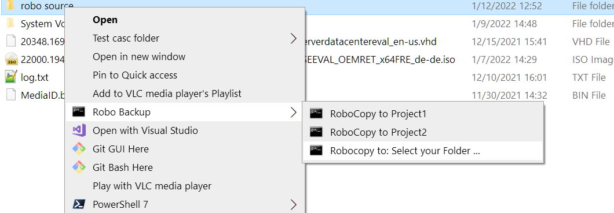

# PowershellScripts
powershell backup from contextmenu with robocopy

- features: predefined destination paths e.g. "Project1" and "Project2" or select with Windows Forms Dialog

- create directory C:\PowerShellScripts\
- copy BackupWithRobo.ps1 in there
- double click reg_complete.reg to add context menus for folder right click and background right click ( not selecting any file or folder)
- c:\PowerShellScripts\robolog.txt saves the output of the last run

- change $mainBackupDir = "D:\Robo Backup" to suite your needs

- will create directory with date&timestamp in destination dir and in there a dir with source dir name

Right click on folder:

Right click in background in opened folder will also copy all contents:

This will open Winforms Formular:

Select Path dialog:

selected path will show up in form, click ok to copy:

